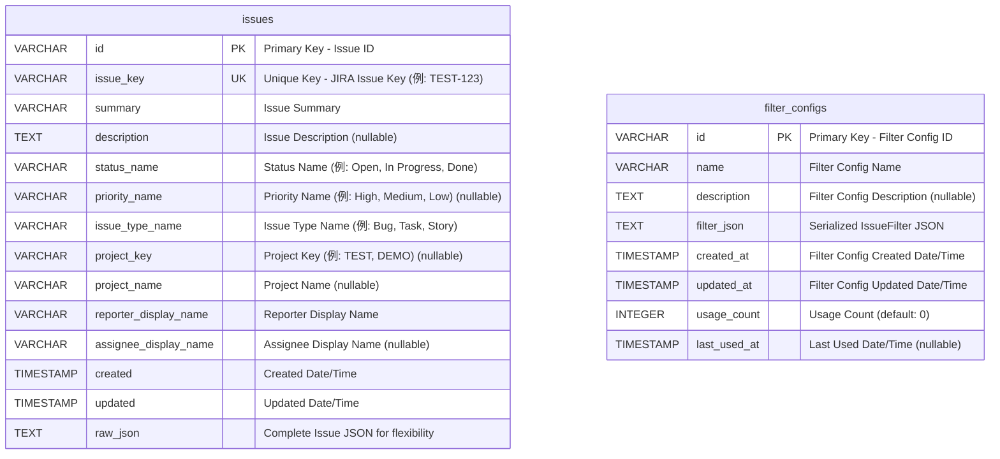

# DuckDBStore ER図

## 概要

DuckDBStoreで使用するデータベーススキーマのEntity-Relationship図です。
JIRAのIssueデータとフィルター設定を効率的に格納・検索するための設計を示しています。

## ER図



## テーブル詳細

### issues テーブル

**目的**: JIRAのIssue情報を構造化して格納

| カラム名 | データ型 | 制約 | 説明 |
|---------|---------|------|------|
| id | VARCHAR | PRIMARY KEY | IssueのユニークID |
| issue_key | VARCHAR | UNIQUE NOT NULL | JIRAのIssueキー（例: TEST-123） |
| summary | VARCHAR | NOT NULL | Issueのサマリー |
| description | TEXT | NULL | Issueの説明 |
| status_name | VARCHAR | NOT NULL | ステータス名 |
| priority_name | VARCHAR | NULL | 優先度名 |
| issue_type_name | VARCHAR | NOT NULL | Issue種別名 |
| project_key | VARCHAR | NULL | プロジェクトキー |
| project_name | VARCHAR | NULL | プロジェクト名 |
| reporter_display_name | VARCHAR | NOT NULL | 報告者表示名 |
| assignee_display_name | VARCHAR | NULL | 担当者表示名 |
| created | TIMESTAMP | NOT NULL | 作成日時 |
| updated | TIMESTAMP | NOT NULL | 更新日時 |
| raw_json | TEXT | NOT NULL | 完全なIssue JSON |

**インデックス**:
- `idx_issues_project_key` - プロジェクト別検索の高速化
- `idx_issues_status_name` - ステータス別検索の高速化
- `idx_issues_created` - 作成日時ソートの高速化
- `idx_issues_updated` - 更新日時ソートの高速化

### filter_configs テーブル

**目的**: フィルター設定の永続化と管理

| カラム名 | データ型 | 制約 | 説明 |
|---------|---------|------|------|
| id | VARCHAR | PRIMARY KEY | フィルター設定ID |
| name | VARCHAR | NOT NULL | フィルター設定名 |
| description | TEXT | NULL | フィルター設定の説明 |
| filter_json | TEXT | NOT NULL | IssueFilterのシリアライズJSON |
| created_at | TIMESTAMP | NOT NULL | 作成日時 |
| updated_at | TIMESTAMP | NOT NULL | 更新日時 |
| usage_count | INTEGER | NOT NULL DEFAULT 0 | 使用回数 |
| last_used_at | TIMESTAMP | NULL | 最終使用日時 |

## データ型の選択理由

### VARCHAR vs TEXT
- **VARCHAR**: 固定長または短い可変長文字列（ID、名前、キー）
- **TEXT**: 長い可変長文字列（説明、JSON）

### TIMESTAMP
- UTC基準の日時格納
- DuckDBの時系列分析機能を活用

### JSON格納戦略
- **構造化カラム**: 頻繁に検索・ソートされるフィールド
- **raw_json**: 完全なデータ保持とフレキシビリティ確保

## 検索クエリの最適化

### 主要な検索パターン

1. **プロジェクト別検索**
   ```sql
   SELECT * FROM issues WHERE project_key = 'TEST'
   ```

2. **ステータス別検索**
   ```sql
   SELECT * FROM issues WHERE status_name IN ('Open', 'In Progress')
   ```

3. **時間範囲検索**
   ```sql
   SELECT * FROM issues WHERE created BETWEEN '2024-01-01' AND '2024-12-31'
   ```

4. **複合検索**
   ```sql
   SELECT * FROM issues 
   WHERE project_key = 'TEST' 
     AND status_name = 'Open' 
     AND created >= '2024-01-01'
   ORDER BY created DESC
   ```

### フィルター設定管理

1. **最新のフィルター設定取得**
   ```sql
   SELECT * FROM filter_configs ORDER BY updated_at DESC LIMIT 1
   ```

2. **使用頻度による設定一覧**
   ```sql
   SELECT * FROM filter_configs ORDER BY usage_count DESC
   ```

## パフォーマンス特性

### DuckDBの利点
- **列指向ストレージ**: 分析クエリに最適
- **自動圧縮**: ストレージ効率の向上
- **ベクトル化実行**: 高速な集計処理

### 想定データ量とパフォーマンス
- **小規模**: 1万件未満 - 全機能で優秀なパフォーマンス
- **中規模**: 10万件程度 - インデックス効果で高速検索
- **大規模**: 100万件以上 - DuckDBの分析エンジンが威力発揮

## 拡張性の考慮

### 将来の拡張ポイント
1. **カスタムフィールド対応**: `raw_json`からの動的抽出
2. **全文検索**: DuckDBのFTS機能活用
3. **時系列分析**: 作成・更新日時の詳細分析
4. **集計ビュー**: マテリアライズドビューによる事前集計

### スキーマ進化戦略
- **後方互換性**: `raw_json`による完全データ保持
- **段階的移行**: 新カラム追加時の既存データ対応
- **バージョン管理**: スキーマバージョンの明示的管理

## セキュリティとデータ整合性

### 制約による整合性保証
- **PRIMARY KEY**: ユニーク性保証
- **NOT NULL**: 必須フィールドの強制
- **UNIQUE**: issue_keyの重複防止

### トランザクション制御
- **ACID特性**: DuckDBによる完全なトランザクション保証
- **バッチ処理**: 大量データ投入時の効率性
- **ロールバック**: エラー時の安全な復旧

このER図は、JIRAデータの効率的な格納・検索・分析を可能にする設計となっています。